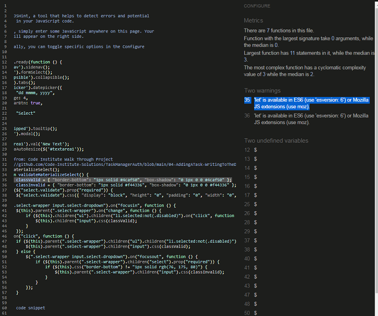

 # ***[Grant Finder](http://grant-finder-pro.herokuapp.com/get_grants)***  
  
[](http://grant-finder-pro.herokuapp.com/get_grants) 

---   
  
# Project Description   
**Code Institute: Backend Development Milestone Project**  
  
The Milestone 3 project assignment is to  build a full-stack site that allows your users to manage a common dataset about a particular domain. I have the option to choose from one of the  following three scenarios or to come up with my own idea:  
. Create an online cookbook    
. Create a jargon glossary/dictionary for a particular domain   
. Build a book review and recommendation site. 
   
I have decided to create a website called Grant Finder which will act as a portal for users to upload details of Grant opportunities that are available.  The user will have to register in order to be able to upload a Grant and they will need to specify if they are registering as an individual, on behalf of a voluntary/community group or as a representive of the awarding grants body.  The site will contain several categories of grants such as Community Development, Community Events, Festival Grants, Sports etc.  For the scope of the project the site will focus on North Kildare, however I have chosen to keep the site name quite general as this leaves room to scale the site at a future date.  For example the site could be sacled to National coverage with an additional layout of categories to allow filtering by county.

# Project Requirements

## Main Technologies
. HTML, CSS, JavaScript, Python+Flask, MongoDB

. Additional libraries and external APIs

## Mandatory Requirements
  
1. Data handling: Build a MongoDB-backed Flask project for a web application that allows users to store and manipulate data records about a particular domain. If you are considering using a different database, please discuss that with your mentor first and inform Student Care.
2. Database structure: Put some effort into designing a database structure well-suited for your domain. Make sure to put some thought into the nesting relationships between records of different entities.
3. User functionality: Create functionality for users to create, locate, display, edit and delete records (CRUD functionality).
4. Use of technologies: Use HTML and custom CSS for the website's front-end.
5. Structure: Incorporate a main navigation menu and structured layout (you might want to use Materialize or Bootstrap to accomplish this).
6. Documentation: Write a README.md file for your project that explains what the project does and the value that it provides to its users.
7. Version control: Use Git & GitHub for version control.
8. Attribution: Maintain clear separation between code written by you and code from external sources (e.g. libraries or tutorials). Attribute any code from external sources to its source via 9.comments above the code and (for larger dependencies) in the README.
9. Deployment: Deploy the final version of your code to a hosting platform such as Heroku.
10. Make sure to not include any passwords or secret keys in the project repository.  

  
---    
 
# UX Design    
 
## Strategy     
   
### User Stories:  
    
The user is looking 
 
  - #### First Time Visitor Goals
 
   1. As a First Time Visitor, I want to understand the purpose of the site before I register.  
   2. As a First Time Visitor, I want to see a summary of the most recent content without having to register.  
   3. As a First Time Visitor, I want to register without having to give too much personal information.  
   4. As a First Time Visitor, I want to be able to filter Categories of Grants.  
   5. As a First Time Visitor, I want to be able to search for a grant by keywords.  
   6. As a First Time Visitor, I want to know the Issuing body of the grant.  
   7. As a First Time Visitor, I want information about the application process.  
   8. As a First Time Visitor, I want to know the application opening and closing dates.  
   9. As a First Time Visitor, I want a link to the application form/portal.   
   10. As a First Time Visitor, I want a link to any supporting documentation / guidelines provided by the issuing body.  
   11. As a First Time Visitor, I want to be able to upload details of a grant for other user to apply for.  
   12. As a First Time Visitor, I want to be able to contact the site owner for basic support if I have any queries about the site.   
 
   - #### Returning & Frequent Visitor Goals
 
   1. As a Returning Visitor, I want to be able to log in easily.  
   2. As a Returning Visitor, I want to be able to see a list of all the grants that I have uploaded in my User Profile when I log-in. 
   3. As a Frequent User, I want to be able to update / amend details of grants that I have uploaded.   
   4. As a Frequent User, I want to be able to delete grants that I have uploaded.  

   - #### Site Owner Goals   
   1. As the site owner, I want to promote a collaborative environment for the sharing of information regarding Grant opportunities for local community groups, clubs & projects.  
   2. As the site owner, I want to be able to edit or remove content uploaded by other users.  
   3. As the site owner, I want to be able to add, edit or delete categories of Grants.  
  
 
---  
      
# Scope   
 
## Functional Specification   
 
### Current feature requirements:     
* Fully responsive website that will automatically adapt for desktop, tablet and mobile devices.  
* A navigation bar across the top of the page that is clear and simple to user.  
* A Nav Logo that makes it easy for the user to return to the home page.  
* A home page that clearly identifies the purpuse of the site.  
* A home page that gives a summury of all the grants currently available in the database.  
* A simple Contact form in the footer so that the user can easily email the site owner if they have a query. 
* A Search box at the top of the home page to filter grants by relevent keywords (one the user is logged in).   
* The ability to Add a new grant to the database if you are a registered user who is logged in.  
* The ability to Edit a grant that you have previously uploaded (once the user is logged in).  
* The ability to Delete a grant that you have previously uploaded (once the user is logged in).  
* The ability for an Admin user to access a Maintenance page where they can Add, Edit or Delete a Category or Organisation.  
* The ability for the Admin user to Edit or Delete a user.  
  
### Future feature requirements:    
* The implementation of pagination on the home page to only show 5 grant summaries per page to reduce the amount of scrolling and to maintain the page load time as the database grows.  
* The ability for a user to reset their password should they forget it.  
* The site could be scaled to National coverage and would require additional filtering, for example to display grant per county.  
 
 [Back to Content](#content)  
 
---      
       
# Structure    
  
## wireframes
[Mobile](./static/images/readme/rm-wireframe-mobile.png)  
  
[Desktop](./static/images/readme/rm-wireframe-desktop.png)  
        


         
## Visual Design   
My colour palette was heavily by the codepen template that I have adapted as the base for my [site layout](https://codepen.io/rinaw/pen/pGxorQ).   
I inputted the colours into the [coolors.co](https://coolors.co/384364-ffd2b0-f6f7eb-cccccc-333333) colour palette generate to check that I was happy with them and I used Google Dev Tools to check the colour contrast worked with white and black text.  
  
   

In order to test my colour palette prior to starting to code I've created a partial mock-up of my wireframe for the  
the desktop view and I'm satisfied it works.  
  
  

  --- 
    
# Technologies Used  

## Languages Used

-  [HTML5](https://en.wikipedia.org/wiki/HTML5)

-  [CSS3](https://en.wikipedia.org/wiki/Cascading_Style_Sheets)

  
### Frameworks, Libraries & Programs Used

* [__Flask 2.0.1__](https://pypi.org/project/Flask/) This was the main framework used to build the app. 
* [__jquery 3.6.0__](https://blog.jquery.com/) Used to handle the Javascript element of some of the Materialize features used in the project. 
* [__Materialize 1.0.0__](https://materializecss.com/) Materialize Grid was used for responsiveness as well as features such as Cards, Tabs & Buttons.  
* [__Balsamiq__](https://balsamiq.com) Balsamiq was used to create wireframes during the design process. 
* [__Jinja__](https://jinja.palletsprojects.com/en/3.0.x/templates/) Was used to create the Python templates.   
* [__Heroku__](https://heroku.com/) The cloud platform for deploying the app.  
* [__MongoDB__](https://mongodb.com/) The application database.  
* [__Google Fonts__](https://fonts.google.com) used for project fonts.  
* [__Gitpod__](https://gitpod.io) Gitpod was the IDE used to create the site and for version control.  
* [__Github__](https://github.com/) GitHub is used to store the projects code after being pushed from Gitpod.  
* [__RandomKeygen__](https://randomkeygen.com/) The Secure Password & Keygen Generator.  
* [__Gauger__](https://gauger.io/fonticon/) Convert Font Awesome Icon into Favicon.  
* [__Fontawesome__](https://fontawesome.com) Font Awesome was used for the Icons throughout the site.  
* [__coolors.co__](https://coolors.co/384364-ffd2b0-f6f7eb-cccccc-333333) used for colour palette selection.  
* [__TinyPNG__](https://tinypng.com/) used to compress image sizes.  
* Mozilla DevTools used for debugging and testing.  
* Google DevTools used for debugging and testing.  
* [__W3Scool__](https://www.w3schools.com/) used as a general source of information.  
* [__Unsplash__](https://unsplash.com/) used to download images for the website.  
* [__Stackoverflow__](https://stackoverflow.com/) used as one of my main sources of information.  
* [__W3C Markup Validator__](https://validator.w3.org/) Used to test HTML code validation.  
* [__W3C CSS Validatior - Jigsaw__](https://jigsaw.w3.org/css-validator/) Used to test CSS code validation.  
* [__jshint Validatior__](https://jshint.com/) Used to test Javascript / JQuery code validation.
* [__PEP8 Validatior__](http://pep8online.com/) Used to test that Python code is PEP8 compliant.
* [__Mobile-Friendly Test__](https://search.google.com/test/mobile-friendly?id=ZteYI-6sVDRnrLMf_Chjmw) used to check if code is Mobile Friendly.  
* [__Am I Responsive__](http://ami.responsivedesign.is/) used to create Mock-up images to represent the site's responsiveness.  
* [__GitHub Wiki TOC generator__](https://ecotrust-canada.github.io/markdown-toc/) Markdown Table of Content Generator.  
  
[Back to Content](#content)  

--- 
   
# TESTING  

The entire testing process, issues and bugs found during development, solutions, and final results can be found [here]().

- Development Notes  

Original two codpens I wanted to use for the page layout proved to complicated to implement so I add to find an alternative SVG wave separator to use which I was able to maniptlate.
  
  Materalize Select / dropdown - unsure if took name attribute  
  --> https://stackoverflow.com/questions/39130659/materialize-css-select-does-not-have-name-nor-proper-value-in-dom    
      
On grants.html I had forgottent to change the tab numbers for the second card which I had copied from the first card for left-hand side layout and I had the "Created By" div one row too far down the code. This was easy enough to correct but contents of the columns is still overlaping as the external url's are too long and the section container holding the two cards isn't resizing as new grants are added. Plus layout issue with the materalize tabs is likely to return once I add additional new grants as odd numbered left-hand layout will all have tabs 1,2 & 3 and even numbered right-hand tabs will all have tabs 4,5 & 6.
        
- Bugs
  
  Materialize Modal ID's  
  https://stackoverflow.com/questions/7537439/how-to-increment-a-variable-on-a-for-loop-in-jinja-template  
  https://www.youtube.com/watch?v=8OuSc0Q_4tI  
  https://www.youtube.com/watch?v=Krrb2M8PwEQ  
  
  


- HTML Validation  
  
  
- CSS Validation  
  
  
- JShint Validation  
  
  
- PEP8 Validation  
  
  
- Mobile Friendly Test  
   
  
- Dev Tools - Lighthouse  
  


##  Manual Testing  

* To view the manual testing file [click here](https://github.com/StephenJ2020/workspace/Grant-Finder/manual-testing.md)


##  User Stories Testing  


 
  
# Deployment

This project was built using Gitpod and pushed to Github using the terminal interface. However, as Github can only host static websites the project had to be deployed to Heroku as it is compatible for hosting a back-end focused site.  

This project was deployed using Heroku and stored in GitHub.

Before deploying the website to Heroku, the following three must be followed to ensure that the app will work in Heroku:  
  
1. Create requirements.txt file that contains the names of packages being used in Python. It is important to update this file if other packages or modules are installed during project development by using the following command:

    - pip freeze --local > requirements.txt

2. Create Procfile that contains the name of the application file so that Heroku knows what to run. If the Procfile has any blank lines they should be removed as they may cause issues.

3. Push these files to the project Repo in GitHub.  
  
Once those steps are done, the website can be deployed in Heroku using the steps listed below:

### Deployment Steps

1. Log into Heroku.
2. Click the New button.
3. Click the option to create a new app.
4. Enter the app name in lowercase letters.
5. Select the correct geographical region.

### Set environment variables:

  
  
Navigate to the settings tab and then click the Reveal Config Vars button and add the following:
  
  
  
 

1. key: IP, value: 0.0.0.0
2. key: PORT, value: 5000
3. key: MONGO_DBNAME, value: (the name of the database that is being used for the project)
4. key: MONGO_URI, value:
 * This can be found in MongoDB by navigating  to the clusters section of your MongoDB account.
 * Click the cluster where the database is located.
 * Click the connect button.
 * Select the connect you application button.
 *  Copy the link provided to your application and ensure you have substituted the password and dbname with the correct values).
5. key: SECRET_KEY, value: (This is a custom secret key set up for configuration to keep client-side sessions secure).


### Enable automatic deployment:

1. Click the Deploy tab  
  
  
  
2. In the Automatic deploys section, choose the branch you want to deploy from then click Enable Automation Deploys.
  
   
  


### Connect app to Github Repository

1. Click the deploy tab and connect to GitHub.  
  
2. Type the name of the repository into the search bar presented.  
  
  
    
3. Click the Code dropdown button next to the green Gitpod button.  
  
4. When the correct repository displays click the connect button.  


### Making a clone to run locally

It is important to note that this project will not run locally unless an env.py file has been set up by the user which contains the IP, PORT, MONGO_DBNAME, MONGO_URI and SECRET_KEY which have all been kept secret in keeping with best security practices. 

1. Log into GitHub.
2. Select the [respository](https://github.com/StephenJ2020/Grant-Finder).  
3. Click the Code dropdown button next to the green Gitpod button.
4. Download ZIP file and unpackage locally and open with IDE. Alternatively copy the URL in the HTTPS box.
5. Open the alternative editor and terminal window.
6. Type 'git clone' and paste the copied URL.
7. Press Enter. A local clone will be created.

Once the project been loaded into the IDE it is necessary to install the necessary requirements which can be done by typing the following command.

    -pip install -r requirements.txt

### How to Fork the respository.

By forking the GitHub Repository you make a copy of the original repository on your own GitHub account to view and/or make changes without affecting the original repository by following these simple steps:

1. Log in to GitHub and locate the [StephenJ2020/Grant-Finder Repository](https://github.com/StephenJ2020/Grant-Finder)
2. Near the top of the Repository, on the right-hand side of the screen, locate the "Fork" button.
3. Click this button and you should now have a copy of the original repository in your GitHub account.
  
### Making a Local Clone

1. Log in to GitHub and locate the [StephenJ2020/Grant-Finder Repository](https://github.com/StephenJ2020/Grant-Finder)
2. Under the repository name, click "Clone or download".
3. To clone the repository using HTTPS, under "Clone with HTTPS", copy the link.
4. Open Git Bash
5. Change the current working directory to the location where you want the cloned directory to be made.
6. Type `git clone`, and then paste the URL you copied in Step 3.
```
$ git clone https://github.com/StephenJ2020/Grant-Finder
```
7. Press Enter. Your local clone will be created.
```
$ git clone https://github.com/StephenJ2020/Grant-Finder
> Cloning into `CI-Clone`...
> remote: Counting objects: 10, done.
> remote: Compressing objects: 100% (8/8), done.
> remove: Total 10 (delta 1), reused 10 (delta 1)
> Unpacking objects: 100% (10/10), done.
``` 


# Credits
  
  
-   https://codepen.io/tayfunerbilen/pen/dyPeKxR SVG wave separator for header in base.html
-   https://smooth.ie/blogs/news/svg-wavey-transitions-between-sections SVG wave separator for footer in base.html
-   https://www.pikpng.com/pngl/b/497-4971265_internet-of-things-companies-digitalisation-vector-clipart.png Nav Logo

  

   
# Acknowledgements     

I would like to thank the following people for their support and guidance during this project:    
- My Mentor Chris Quinn.  
- Code Institute Tutor Support.  
- The Code Institute Slack Community.  
-  
    
