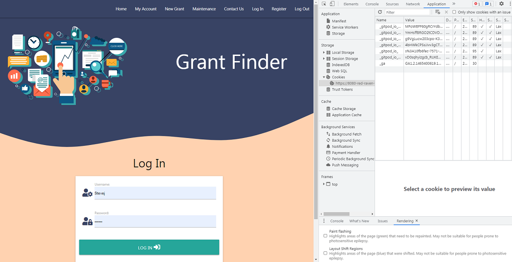
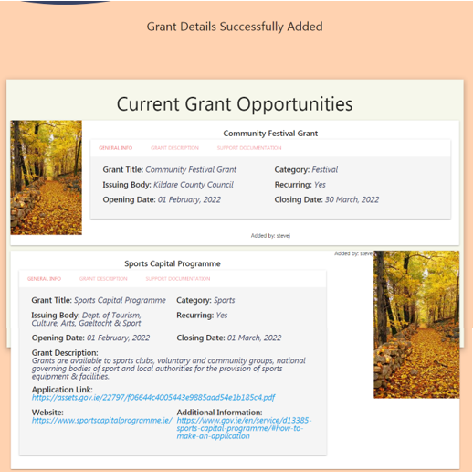
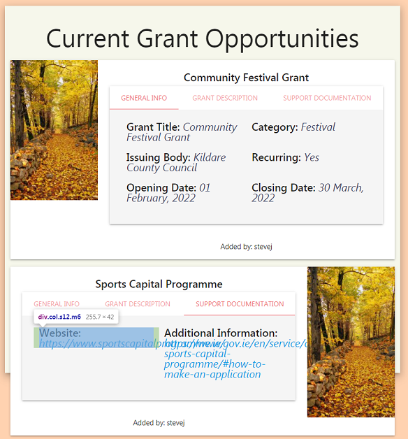

## User Log In  

 with incorrect Password.  
 Sucessfully Logged In. 

## Register New User  
  

  
    
## Session Cookie  
  
  
  
  
## Add New Grant  
  
  
 
 
    
## Delete a Grant  
  
     
  
## Defensive Programming with Jinja  
  Admin access only via Maintenance page.
 Admin access only via Maintenance page.
 Admin access only via Maintenance page.
